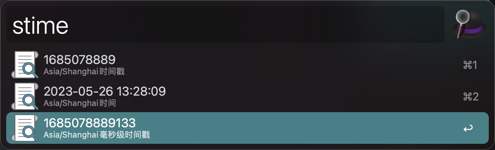

# su-alfred-workflow
使用php编写的alfred的便捷工具

## 使用要求
```
php >= 7.4
```

由于alfred是macos软件，建议使用brew安装
```shell
brew install php
```

## 安装
直接将 sutil.alfredworkflow 导入到 Alfred 中，并设置环境变量 ROOT 为 sutil 的本地项目根路径即可(为了使用 composer 来进行自动加载)

## sutil(small and super util)
一些便捷工作流(持续更新中，如果有好的想法也可以联系以沟通交流)

**sutil中的工具的关键字以s作为前缀**

### md5
```shell
smd5 <string>
```


### password: 随机密码
```shell
spassword <password-length(默认16字符)>
```


### time: 时间(时区:Asia/Shanghai)
```shell
# 当前时间和时间戳
stime
```



```shell
# 指定时间戳转换成时间
stime <timestamp>
```


```shell
# 指定时间转时间戳
stime <datetime>
```


### unicode: 对字符串进行unicode编码和解码
```shell
sunicode <unicode_string>
```


### url: 解析url(先decode)
1. 对url进行decode
2. 解析url(scheme, host, port, uri, query, query(json))

```shell
surl <url>
```


### ip: ip处理
```shell
# 获取本机内网和外网ip
sip
```


```shell
# 获取对应ip归属地
sip <ip>
```


### dark
```shell
sdark
```


## ssh
ssh工作流
**ssh工作流中的关键字前缀为 ssh**

### 添加ssh到工作流中进行管理:
```sh
sshadd <user_name>@<ip>[ <ssh_name>]
```


### sshremove: 删除ssh
```sh
sshremove [<user_name>|<ssh_name>]
```


### sshlogin: 登录ssh
```sh
sshlogin [<user_name>|<ssh_name>]
```

### sshkey: 读取公钥
```shell
sshkey
```


### sshconfig: 打开或在Finder中查看(按住cmd)ssh配置文件(~/com.simanx.alfred.ssh/ssh_config.json)
```sh
sshconfig
```

